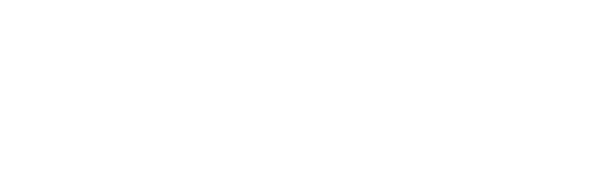
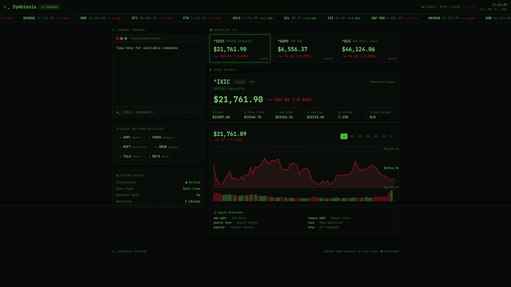

<div align="center">



**The Final Protocol for Real Finance.**



[](https://github.com/aeroxol5000/symbiosis)
[](https://www.gnu.org/licenses/gpl-3.0)
[](https://symbiosis-xol.vercel.app/)
[](https://github.com/aeroxol5000/symbiosis/graphs/commit-activity)

---

### "Finance. But Sexy"
*Symbiosis is the future of advanced and high-quality data to help you not the corporations*

[Website]([https://symbiosis-finance.pages.dev/])
[Contact](mailto:aeroforge-co@outlook.com)


</div>

---

## The Signal
Traditional "bro-finance" is built on noise, gatekeeping, and volatility. **Symbiosis** is built on:
- **Zero Friction:** Institutional-grade UI for seamless interaction.
- **Deep Connectivity:** Interconnected financial logic that actually scales.
- **Anti-Hype:** No fluff, no emojis, just pure functional code.
- **Open Source:** Licensed under **GPLv3**—finance belongs to the people, not the minority.

## Key Features
* **Adaptive Interface:** Seamlessly transitions from high-density data views to simplified mobile interfaces.
* **Modular Architecture:** Built with Next.js App Router for maximum composability.
* **Performance First:** 100/100 Lighthouse scores. If the data isn't fast, it isn't useful.
* **Accessible Logic:** Fully ARIA-compliant components via Radix UI.

## Architecture
```text
.
├── app/                # Next.js App Router (Logic & Routing)
├── components/         # Shadcn/UI & Custom Components
├── public/             # Static Assets (Images/Icons)
├── styles/             # Tailwind Global Config
├── lib/                # Utility functions & Shared Logic
└── hooks/              # Custom React Hooks
```
Tech Blueprint
Core: Next.js 14+ (React)

License: GNU GPLv3

Design: Tailwind CSS + Shadcn/UI

Deployment: Vercel Edge Network

Deployment
Bash
# Clone the repo
```bash
git clone [https://github.com/aeroxol5000/symbiosis.git](https://github.com/aeroxol5000/symbiosis.git)
```

# Enter the ecosystem
```bash
cd symbiosis
```

# Install dependencies
```bash
npm install
```

# Initiate local node
```bash
npm run dev
```

Contributing
We welcome contributors who support the project and cause. Submit a pull request and our team will review your code. Please email us [here](mailto:aeroforge-co@outlook.com)

<div align="center">

Built by Callum Chang (AEROmicro) Destroying the noise. Building the future.

